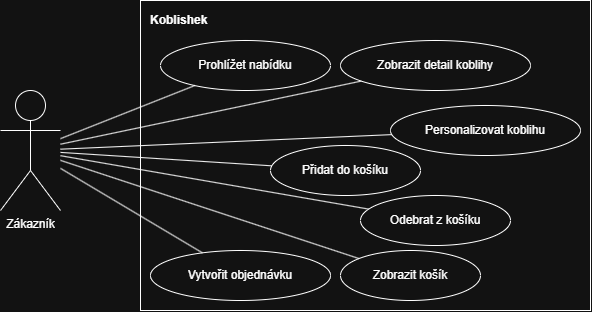

# Koblishek

Jednoduchý fiktivní e-shop na personalizované koblihy.

## Cíl projektu

Návrh a implementace jednoduchého e-shopu na kterém budu demonstrovat základní principy softwarového inženýrství.

## Tech stack

- HTML
- CSS
- JavaScript
- Git
- GitHub
- UML (Draw.io)

## Dokumentace

- [Requirements](docs/requirements.md)

## UML

### Use Case diagram

